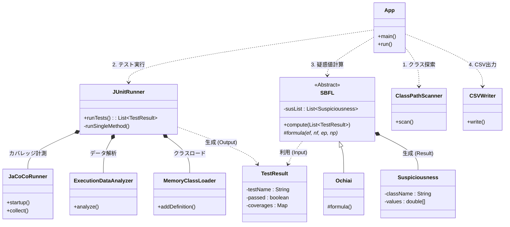

# basic_sbfl_engine

JAVAプログラムに対して基本的なSBFLを行う。
classファイルを与えることで動作する。


## Requirements
- JDK17
- junit4

## How To Use

classファイルは用意しておく必要がある。

### example - CUI

./gradlewは必須

```console
$ ./gradlew shadowJar
```

```console
$ java -jar basic_sbfl_engine.jar -h
```

```console
$ java -jar basic_sbfl_engine.jar -p ./example -o result.csv -t example.TriangleTest -c example.Triangle
```

| Option | Description | Required | Default |
| :--- | :--- | :---: | :---: |
| `-p`, `--path` | Path to the folder containing class files. | **Yes** | - |
| `-o`, `--output` | Define the path for the output CSV file. | No | (stdout) |
| `-t`, `--test` | Run only selected test classes. (Split by `,`) | No | All tests |
| `-c`, `--class` | Specify the classes used to compute SBFL scores. (Split by `,`) | No | All classes |
| `--timeout` | Set the timeout (ms) for each test method. | No | `2000` |
| `-v`, `--verbose` | Show test execution logs (standard out/err). | No | `false` |

### example - In java project

```java
SBFL sbfl = new Ochiai();

String folderPath = "./example"; // Folder which contains class Files.
List<String> testClassNames   = null; // ex : ["com.example.MainTest"]
Set<String>  targetClassNames = null; // ex : ["com.example.Main"]
long timeout = 3000; // ms

sbfl.compute(folderPath, testClassNames, targetClassNames, timeout);

List<Suspiciousness> list = sbfl.getSusList();
```

## spec
- classファイルはフォルダを再帰的に全探索するため、階層構造に縛りがない
- 複数クラスで動くプロジェクトに対してもSBFLを行うことができる
- testが無限ループしたときの対策にタイムアウト処理がある
- 実行するtestクラスの指定が可能 ex:`com.example.MainTest`
- 計測対象のクラスの指定が可能 ex:`com.example.Main`

<details> <summary> 内部構造メモ </summary>


</details>
